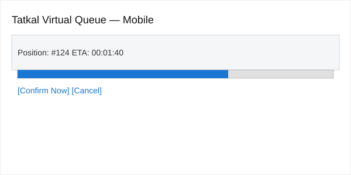
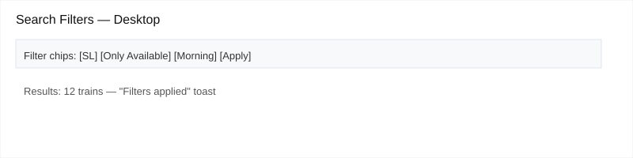
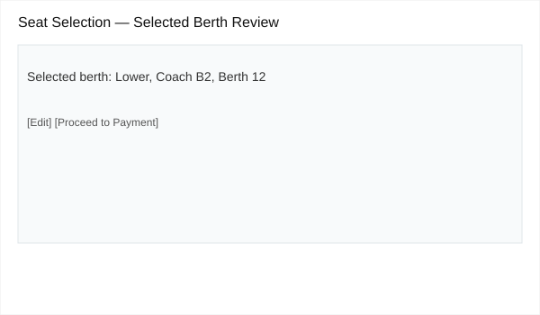
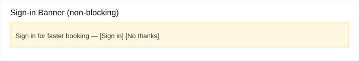
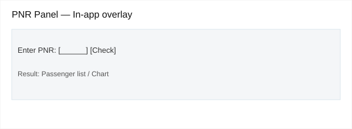
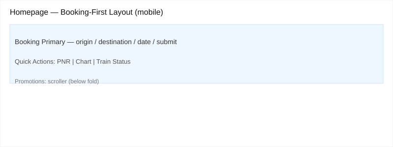

## Part B — Feature Specifications

All specs below continue from the discovery in [PROBLEMS.md](../part-a/PROBLEMS.md). Each spec references the original problem framing and fixes the precise failure point documented in Part A.

---

## Feature Spec 1: Tatkal Virtual Queue and Progress (Problem 1)

### Problem Statement
Tatkal bookings fail silently at the 10:00 AM surge leaving users unsure whether their request is queued, processed, or lost. See the original discovery in [PROBLEMS.md](../part-a/PROBLEMS.md). Affected: last-minute travellers; Failure point: lack of queue position and progress at peak (Part A, Step 6).

### Current State (from Part A)
The booking stalls when traffic spikes during the Tatkal opening (Part A flow steps 5–7). The UI provides no reliable queue position, progress, or retry guidance, and inventory is often consumed while the user waits.

### Proposed Solution
Introduce a virtual, server-backed Tatkal queue that assigns stable queue positions, shows an estimated wait time and a real-time progress bar, and allows users to confirm or cancel when their turn arrives. If quota is exhausted before a user reaches the front, show a clear failure reason and suggest alternatives.

### Proposed User Flow — Step by Step
1. User prepares and submits Tatkal request at 10:00 AM.
2. Server accepts the request and returns a queue token + position (e.g., #124).
3. UI shows queue card: position, ETA, progress bar, and option to auto-accept or manual confirm.
4. Queue advances; position updates every few seconds via WebSocket or SSE.
5. When near front, system reserves seat for a short confirmation window (e.g., 30s).
6. User confirms booking or the reservation times out and the token is released.
7. Success: booking completes and PNR issued; Failure: clear reason and suggestions (alternative trains, waitlist, or refund).

### Technical Implementation Plan
**System components affected:**
- Booking API, Tatkal quota service, session management, frontend search/booking UI, notification service.

**New data requirements:**
- `tatkal_queue` table: {queue_token, user_id(optional), request_payload, status, position_index, created_at, reserved_until}

**API changes:**
- POST `/tatkal/queue` — enqueue request, returns `queue_token` and `position`.
- GET `/tatkal/queue/:token` — poll queue state.
- WebSocket `/tatkal/queue/stream` — push updates (position, ETA, state).
- POST `/tatkal/queue/:token/confirm` — user confirms reservation.

**Frontend changes:**
- `TatkalQueueCard` component showing position, ETA, progress bar, and confirm button.
- Hook to WebSocket or SSE for real-time updates.
- Fallback polling for environments without WebSocket.

**Third-party services (if any):**
- Real-time layer: small managed WebSocket or SSE (can be self-hosted). No external ML required.

### Success Metrics
- Tatkal booking success rate at 10:00 AM — increase from baseline by X% (target +20%).
- Percentage of users who see a queue position (should reach 95%).
- Reduction in user support complaints mentioning 'silent failure' at Tatkal by 50%.

### Edge Cases and Constraints
- What can go wrong: queue state drift if real-time channel drops — fallback to polling.
- IRCTC constraints: quotas are authoritative from Railway APIs — queue only reserves temporarily and must reconcile with inventory.
- Graceful degradation: if real-time fails, show last known position and poll; allow user to retry or exit the queue.

**Peer review additions:**
- `auto-accept` should be disabled by default and be an explicit user preference stored in profile; opt-in only.

### Wireframe

Caption: Proposed Tatkal virtual queue card — mobile view

---

## Feature Spec 2: Reliable Search Filters with Persisted State (Problem 2)

### Problem Statement
Search filters (class, availability, time-of-day) are unreliable and their state may be lost after navigation, undermining trust (see [PROBLEMS.md](../part-a/PROBLEMS.md)). Affected: users refining search results.

### Current State (from Part A)
Applying filters sometimes doesn't visibly change the result set or the filter selections are lost when navigating back-and-forth (Part A steps 5–8).

### Proposed Solution
Make filters transactional and visibly confirmed: applying filters updates results with an inline toast and persists filter state in URL query params and local/session storage for short-term persistence across navigation.

### Proposed User Flow — Step by Step
1. User applies filters.
2. System updates results and appends filter state to URL (e.g., `?class=SL&onlyAvailable=true&time=morning`).
3. UI highlights active filters and shows a small toast: "Filters applied — 12 results".
4. User navigates to train details and returns: filters restored from URL/local state.
5. User can share or bookmark the URL and retain filter state.

### Technical Implementation Plan
**System components affected:**
- Frontend search page, routing, client-side state store.

**New data requirements:**
- None server-side; optional analytics event for filter usage.

**API changes:**
- No API changes required. Search remains the same; results are driven by query parameters.

**Frontend changes:**
- `FilterBar` component: updates URL query, emits analytics event.
- `usePersistedFilters` hook: syncs filters to URL and sessionStorage.
- Result list subscribes to filter changes and shows animated change indicator.

**Analytics & Accessibility (peer review updates):**
- Emit `filter.apply`, `filter.clear`, and `filter.share` events to analytics with filter payload (no PII).
- Keyboard accessible filter chips and visible focus states for each control; ensure ARIA labels for screen readers.

**Third-party services (if any):**
- Optional analytics (Segment/GA) to track filter conversion.

### Success Metrics
- % of searches where filter state persists after navigation (target 99%).
- Reduction in user reports about "filters not applied" by 80%.
- Increase in successful bookings from filtered searches (relative uplift +8%).

### Edge Cases and Constraints
- URL length limits if many filters; use compact encoding for large states.
- Privacy: do not persist PII in URL.
- When search API returns cached/stale results, show a small "refreshed" tip and allow manual refresh.

### Wireframe

Caption: Filter bar and result toast — desktop view

---

## Feature Spec 3: Preserve Seat/Berth Selection Across Steps (Problem 3)

### Problem Statement
Selected berths are lost between the seat map and passenger details screens (see [PROBLEMS.md](../part-a/PROBLEMS.md)). Affected: users choosing specific berths.

### Current State (from Part A)
User selects a berth in seat map but the choice isn't preserved on the passenger details page (Part A steps 3–6).

### Proposed Solution
Persist the berth selection in a client-side booking object and confirm it with the server when user proceeds. Show a review card summarizing selected berth(s) before final payment.

### Proposed User Flow — Step by Step
1. User selects berth(s) on seat map.
2. Selection saved to `bookingDraft` on client and mirrored to server via `/booking/draft`.
3. On passenger details page, `Selected Berth` card shows chosen berths; users can edit inline.
4. On confirm, server verifies berth availability and locks selected berths for a short window.

### Technical Implementation Plan
**System components affected:**
- Seat map UI, booking draft API, passenger details UI, booking lock/reservation service.

**New data requirements:**
- `booking_draft` object schema: {draft_id, user_id, selected_berths: [{coach, berth}], expires_at}

Additional draft fields (peer review updates):
- `version` (int) for optimistic locking to avoid race conditions.
- `expires_at` default: 15 minutes from creation for unauthenticated sessions; persisted drafts for logged-in users expire after 24 hours.

**API changes:**
- POST `/booking/draft` — save or update draft.
- GET `/booking/draft/:id` — retrieve draft for restoration.
- POST `/booking/lock` — attempt to lock selected berths briefly.

**API error handling (peer review updates):**
- `/booking/draft` responses include conflict handling with `409` and the current `version`; client should surface a Resolve draft action.

**Frontend changes:**
- Seat map writes to `bookingDraft`; passenger details reads and displays a `Selected Berth` review card.
- Inline edit in passenger details re-opens seat map overlay.

**Third-party services (if any):**
- None specifically.

### Success Metrics
- % of bookings where selected berth remains consistent end-to-end (target 99%).
- Reduction in help requests about wrong berth selection by 90%.

### Edge Cases and Constraints
- Race conditions if two users try to lock the same berth — server must reconcile and surface graceful fallback (closest alternative berth suggestion).
- For unauthenticated users, store `bookingDraft` in session; recommend login before final confirm.

### Wireframe

Caption: Selected berth review card — passenger details view

---

## Feature Spec 4: Non-Blocking Search (Remove Premature Login Modal) (Problem 4)

### Problem Statement
Login modal interrupts basic search tasks too early, blocking discovery (see [PROBLEMS.md](../part-a/PROBLEMS.md)). Affected: casual and unauthenticated users.

### Current State (from Part A)
A login dialog appears while a user is still entering search data, blocking the discovery flow (Part A Step 4).

### Proposed Solution
Convert the modal to a lightweight, dismissible banner prompting sign-in only at conversion points. Allow full search and exploration without forcing sign-in. For actions requiring authentication (book/confirm), present a focused, inline sign-in flow.

### Proposed User Flow — Step by Step
1. User starts search; no modal appears.
2. Show a subtle banner: "Sign in to save searches and faster checkout" with dismiss action.
3. User can complete search and view trains; when user chooses to book, a focused inline sign-in prompt appears with a minimal two-field flow.

### Technical Implementation Plan
**System components affected:**
- Frontend landing/search page, auth flow, analytics.

**New data requirements:**
- None.

**API changes:**
- No API changes; reuse existing auth endpoints but present them inline.

**Frontend changes:**
- Replace blocking modal with `SignInBanner` component and `InlineAuthSheet` for conversion points.

**Third-party services (if any):**
- None.

### Success Metrics
- Bounce rate from search page (target: decrease by 10%).
- % of users entering search who proceed to conversion without being forced to sign-in first (target +15%).

### Edge Cases and Constraints
- Security: ensure inline auth uses the same hardened endpoints and XSS/CSRF protections.
- For some regulated flows, government policy may require authentication for certain data — respect those constraints.

### Wireframe

Caption: Non-blocking sign-in banner above search

---

## Feature Spec 5: In-app PNR & Chart Shortcuts (Problem 5)

### Problem Statement
PNR Status and Chart links take users away from the booking context; this fragments the experience (see [PROBLEMS.md](../part-a/PROBLEMS.md)). Affected: users wanting quick lookups.

### Current State (from Part A)
Top utility shortcuts redirect to other domains/windows, breaking continuity (Part A Step 4).

### Proposed Solution
Embed PNR Status and Chart/Vacancy lookups inside the booking shell as lightweight modals or panels that maintain session and layout. Where external systems are authoritative, surface the remote content inside a secure iframe or fetch via backend proxy to preserve context.

### Proposed User Flow — Step by Step
1. User clicks `PNR Status`.
2. An in-app panel opens with a PNR input and result area (no full-page redirect).
3. If the authoritative data is on an external site, backend proxies the request and serves sanitized results in the panel.

### Technical Implementation Plan
**System components affected:**
- Frontend header actions, backend proxy endpoints, auth/session continuity.

**New data requirements:**
- Optional cache layer for PNR lookups to limit repeated calls.

**API changes:**
- GET `/proxy/pnr/:pnr` — fetches and normalizes remote PNR data.

**Frontend changes:**
- `PnrPanel` and `ChartPanel` components; open as overlays preserving booking state.

**Third-party services (if any):**
- Remote Railway PNR/Chart endpoints (read-only). Use backend proxy to avoid CORS and to normalize responses.

### Success Metrics
- % of PNR/Chart actions performed in-app vs redirected (target 95% in-app).
- Time to complete a PNR check (median) reduced by 40%.

### Edge Cases and Constraints
- Data ownership: if remote site forbids embedding, fall back to opening in new tab with clear UX. Cache stale data with TTL and show source attribution.

### Wireframe

Caption: In-app PNR panel overlay

---

## Feature Spec 6: Booking-First Homepage Layout (Problem 6)

### Problem Statement
Promotional content competes with the booking form, burying the primary booking action (see [PROBLEMS.md](../part-a/PROBLEMS.md)). Affected: new and low-frequency users.

### Current State (from Part A)
The booking panel is surrounded by promotional tiles and secondary products that reduce clarity (Part A Steps 2–6).

### Proposed Solution
Redesign the homepage information hierarchy to make the booking panel visually dominant and reduce peripheral noise. Move promotions below the fold and introduce a simplified 'quick start' view for mobile.

### Proposed User Flow — Step by Step
1. User lands on homepage; booking panel is prominent top-left (or full-width on mobile).
2. Quick start toggles let users choose a simple flow: Book Ticket / Check PNR / Train Status.
3. Promotional content is accessible below the fold in a dedicated area.

### Technical Implementation Plan
**System components affected:**
- Frontend homepage layout, A/B testing, analytics.

**New data requirements:**
- Optional flag for experiment targeting layout variants.

**API changes:**
- None.

**Frontend changes:**
- New `HomepageLayout` with `BookingPrimary` region and `PromotionsSecondary` region; responsive heuristics.

**Third-party services (if any):**
- A/B testing or feature flags service (LaunchDarkly or similar) for rollout.

### Success Metrics
- Homepage conversion rate to search/book (target +12%).
- Time-to-first-action (tap/click) reduced by 30%.

### Edge Cases and Constraints
- Stakeholder content needs: reserve a slot for time-sensitive promos but below the primary fold.
- Accessibility: ensure high contrast and clear focus order for the primary booking controls.

### Wireframe

Caption: Booking-first homepage layout — mobile view

---
# Part B Specs

To be filled in Part B.
